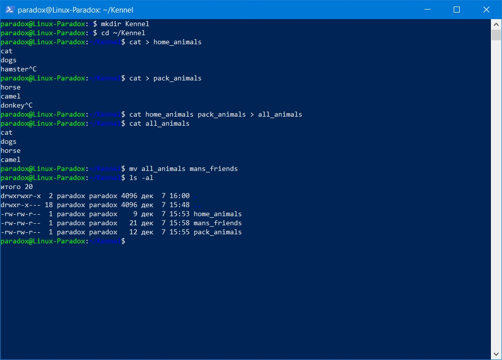
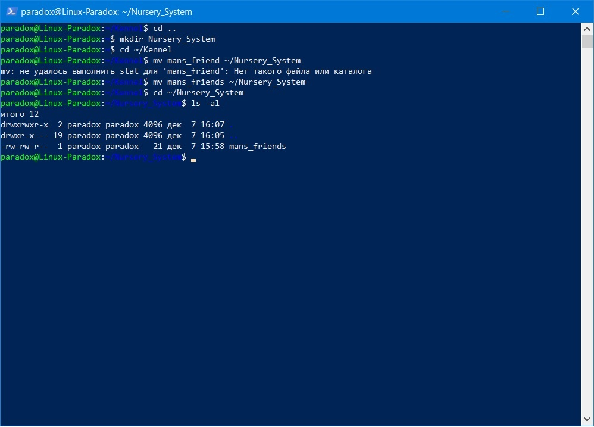
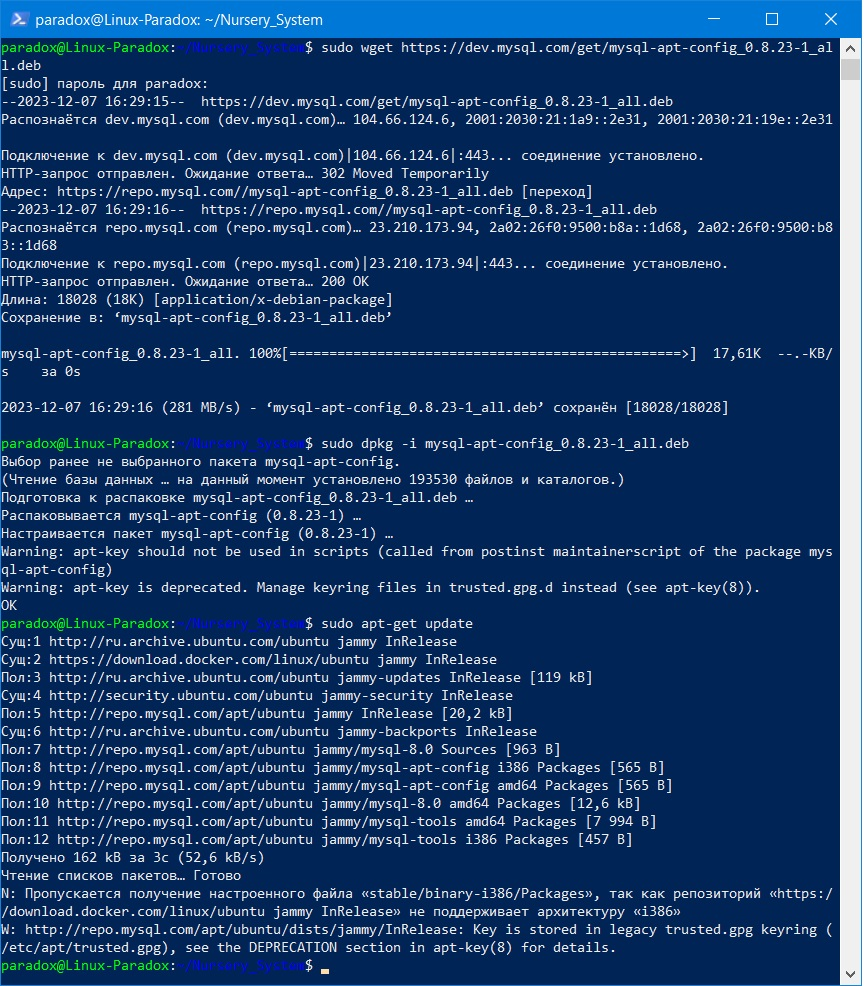
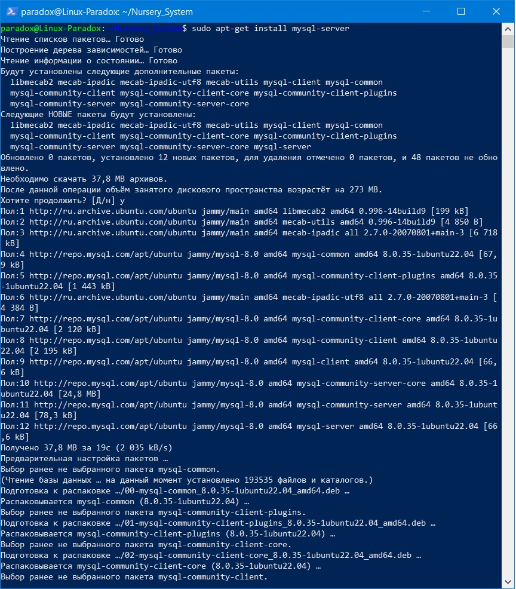
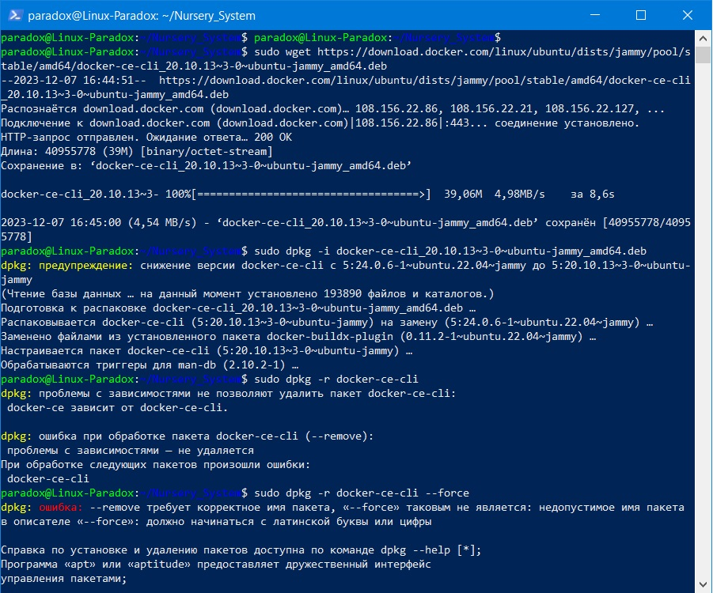
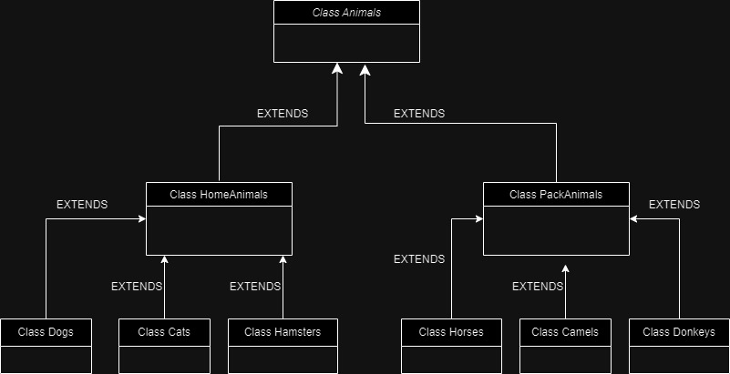

# Итоговая работа по блоку специализация.
## Данный проект создал студент GeekBrains Нештапов Сергей.
* В основе использован язык JAVA
## Задание : Организовать систему учёта для питомника, в котором живут домашние и вьючные животные.
# Операционные системы и виртуализация (Linux)

1. Использование команды cat в Linux
   - Создать два текстовых файла: "Pets"(Домашние животные) и "Pack animals"(вьючные животные), используя команду `cat` в терминале Linux. В первом файле перечислить собак, кошек и хомяков. Во втором — лошадей, верблюдов и ослов.
   - Объединить содержимое этих двух файлов в один и просмотреть его содержимое.
   - Переименовать получившийся файл в "Human Friends"(.
Пример конечного вывода после команды “ls” :
Desktop Documents Downloads  HumanFriends.txt  Music  PackAnimals.txt  Pets.txt  Pictures  Videos


2. Работа с директориями в Linux
   - Создать новую директорию и переместить туда файл "Human Friends".


3. Работа с MySQL в Linux. “Установить MySQL на вашу вычислительную машину ”
   - Подключить дополнительный репозиторий MySQL и установить один из пакетов из этого репозитория.



4. Управление deb-пакетами
   - Установить и затем удалить deb-пакет, используя команду `dpkg`.


5. История команд в терминале Ubuntu
   - Сохранить и выложить историю ваших терминальных команд в Ubuntu.
В формате: Файла с ФИО, датой сдачи, номером группы(или потока)
[Использованные Команды](HistoryUbuntuLinuxCommands.md)

# Объектно-ориентированное программирование 

6. Диаграмма классов
   - Создать диаграмму классов с родительским классом "Животные", и двумя подклассами: "Pets" и "Pack animals".
В составы классов которых в случае Pets войдут классы: собаки, кошки, хомяки, а в класс Pack animals войдут: Лошади, верблюды и ослы).
Каждый тип животных будет характеризоваться (например, имена, даты рождения, выполняемые команды и т.д)
Диаграмму можно нарисовать в любом редакторе, такими как Lucidchart, Draw.io, Microsoft Visio и других.


7. Работа с MySQL (Задача выполняется в случае успешного выполнения задачи “Работа с MySQL в Linux. “Установить MySQL на вашу машину”

7.1. После создания диаграммы классов в 6 пункте, в 7 пункте база данных "Human Friends" должна быть структурирована в соответствии с этой диаграммой. Например, можно создать таблицы, которые будут соответствовать классам "Pets" и "Pack animals", и в этих таблицах будут поля, которые характеризуют каждый тип животных (например, имена, даты рождения, выполняемые команды и т.д.). 
7.2   - В ранее подключенном MySQL создать базу данных с названием "Human Friends".

```sql
CREATE DATABASE Human_friends;
```

- Создать таблицы, соответствующие иерархии из вашей диаграммы классов.
```sql
USE Human_friends;
CREATE TABLE animal_classes
(
	Id INT AUTO_INCREMENT PRIMARY KEY, 
	Class_name VARCHAR(20)
);

INSERT INTO animal_classes (Class_name)
VALUES 
('вьючные'),
('домашние');  


CREATE TABLE pack_animals
(
	Id INT AUTO_INCREMENT PRIMARY KEY,
    Genus_name VARCHAR (20),
    Class_id INT,
    FOREIGN KEY (Class_id) REFERENCES animal_classes (Id) ON DELETE CASCADE ON UPDATE CASCADE
);

INSERT INTO pack_animals (Genus_name, Class_id)
VALUES 
('Лошади', 1),
('Ослы', 1),  
('Верблюды', 1); 
    
CREATE TABLE home_animals
(
	Id INT AUTO_INCREMENT PRIMARY KEY,
    Genus_name VARCHAR (20),
    Class_id INT,
    FOREIGN KEY (Class_id) REFERENCES animal_classes (Id) ON DELETE CASCADE ON UPDATE CASCADE
);

INSERT INTO home_animals (Genus_name, Class_id)
VALUES 
('Кошки', 2),
('Собаки', 2),  
('Хомяки', 2); 

CREATE TABLE cats 
(       
    Id INT AUTO_INCREMENT PRIMARY KEY, 
    Name VARCHAR(20), 
    Birthday DATE,
    Commands VARCHAR(50),
    Genus_id int,
    Foreign KEY (Genus_id) REFERENCES home_animals (Id) ON DELETE CASCADE ON UPDATE CASCADE
);
```

- Заполнить таблицы данными о животных, их командах и датами рождения.
```sql
INSERT INTO cats (Name, Birthday, Commands, Genus_id)
VALUES 
('Whiskers', '2019-05-15', 'Sit, Pounce', 1),
('Smudge', '2020-02-20', 'Sit, Pounce, Scratch', 1),  
('Oliver', '2020-06-30', 'Meow, Scratch, Jump', 1); 

CREATE TABLE dogs 
(       
    Id INT AUTO_INCREMENT PRIMARY KEY, 
    Name VARCHAR(20), 
    Birthday DATE,
    Commands VARCHAR(50),
    Genus_id int,
    Foreign KEY (Genus_id) REFERENCES home_animals (Id) ON DELETE CASCADE ON UPDATE CASCADE
);
INSERT INTO dogs (Name, Birthday, Commands, Genus_id)
VALUES 
('Fido', '2020-01-01', 'Sit, Stay, Fetch', 2),
('Buddy','2018-12-10' , 'Sit, Paw, Bark', 2),  
('Bella', '2019-11-11', 'Sit, Stay, Roll', 2);

CREATE TABLE hamsters 
(       
    Id INT AUTO_INCREMENT PRIMARY KEY, 
    Name VARCHAR(20), 
    Birthday DATE,
    Commands VARCHAR(50),
    Genus_id int,
    Foreign KEY (Genus_id) REFERENCES home_animals (Id) ON DELETE CASCADE ON UPDATE CASCADE
);
INSERT INTO hamsters (Name, Birthday, Commands, Genus_id)
VALUES 
('Hammy', '2021-03-10', 'Roll, Hide', 3),
('Peanut', '2021-08-01', 'Roll, Spin', 3);

CREATE TABLE horses 
(       
    Id INT AUTO_INCREMENT PRIMARY KEY, 
    Name VARCHAR(20), 
    Birthday DATE,
    Commands VARCHAR(50),
    Genus_id int,
    Foreign KEY (Genus_id) REFERENCES packed_animals (Id) ON DELETE CASCADE ON UPDATE CASCADE
);
INSERT INTO horses (Name, Birthday, Commands, Genus_id)
VALUES 
('Thunder', '2015-07-21', 'Trot, Canter, Gallop', 1),
('Storm', '2014-05-05', 'Trot, Canter', 1),  
('Blaze', '2016-02-29', 'Trot, Jump, Gallop', 1);

CREATE TABLE donkeys 
(       
    Id INT AUTO_INCREMENT PRIMARY KEY, 
    Name VARCHAR(20), 
    Birthday DATE,
    Commands VARCHAR(50),
    Genus_id int,
    Foreign KEY (Genus_id) REFERENCES packed_animals (Id) ON DELETE CASCADE ON UPDATE CASCADE
);
INSERT INTO donkeys (Name, Birthday, Commands, Genus_id)
VALUES 
('Eeyore', '2017-09-18', 'Walk, Carry Load, Bray', 2),
('Burro', '2019-01-23', 'Walk, Bray, Kick', 2);

CREATE TABLE camels 
(       
    Id INT AUTO_INCREMENT PRIMARY KEY, 
    Name VARCHAR(20), 
    Birthday DATE,
    Commands VARCHAR(50),
    Genus_id int,
    Foreign KEY (Genus_id) REFERENCES packed_animals (Id) ON DELETE CASCADE ON UPDATE CASCADE
);
INSERT INTO camels (Name, Birthday, Commands, Genus_id)
VALUES 
('Sandy', '2016-11-03', 'Walk, Carry Load', 3),
('Dune', '2018-12-12', 'Walk, Sit', 3),  
('Sahara', '2015-08-14', 'Walk, Run', 3);
```

- Удалить записи о верблюдах и объединить таблицы лошадей и ослов.
```sql
SET SQL_SAFE_UPDATES = 0;
DELETE FROM camels;

SELECT Name, Birthday, Commands FROM horses
UNION SELECT  Name, Birthday, Commands FROM donkeys;
```

- Создать новую таблицу для животных в возрасте от 1 до 3 лет и вычислить их возраст с точностью до месяца.
```sql
CREATE TEMPORARY TABLE animals AS 
SELECT *, 'Лошади' as genus FROM horses
UNION SELECT *, 'Ослы' AS genus FROM donkeys
UNION SELECT *, 'Собаки' AS genus FROM dogs
UNION SELECT *, 'Кошки' AS genus FROM cats
UNION SELECT *, 'Хомяки' AS genus FROM hamsters;

CREATE TABLE yang_animal AS
SELECT Name, Birthday, Commands, genus, TIMESTAMPDIFF(MONTH, Birthday, CURDATE()) AS Age_in_month
FROM animals WHERE Birthday BETWEEN ADDDATE(curdate(), INTERVAL -3 YEAR) AND ADDDATE(CURDATE(), INTERVAL -1 YEAR);
 
SELECT * FROM yang_animal;
```

- Объединить все созданные таблицы в одну, сохраняя информацию о принадлежности к исходным таблицам.
```sql
SELECT h.Name, h.Birthday, h.Commands, pa.Genus_name, ya.Age_in_month 
FROM horses h
LEFT JOIN yang_animal ya ON ya.Name = h.Name
LEFT JOIN packed_animals pa ON pa.Id = h.Genus_id
UNION 
SELECT d.Name, d.Birthday, d.Commands, pa.Genus_name, ya.Age_in_month 
FROM donkeys d 
LEFT JOIN yang_animal ya ON ya.Name = d.Name
LEFT JOIN packed_animals pa ON pa.Id = d.Genus_id
UNION
SELECT c.Name, c.Birthday, c.Commands, ha.Genus_name, ya.Age_in_month 
FROM cats c
LEFT JOIN yang_animal ya ON ya.Name = c.Name
LEFT JOIN home_animals ha ON ha.Id = c.Genus_id
UNION
SELECT d.Name, d.Birthday, d.Commands, ha.Genus_name, ya.Age_in_month 
FROM dogs d
LEFT JOIN yang_animal ya ON ya.Name = d.Name
LEFT JOIN home_animals ha ON ha.Id = d.Genus_id
UNION
SELECT hm.Name, hm.Birthday, hm.Commands, ha.Genus_name, ya.Age_in_month 
FROM hamsters hm
LEFT JOIN yang_animal ya ON ya.Name = hm.Name
LEFT JOIN home_animals ha ON ha.Id = hm.Genus_id;
```

# Пример заполненной таблицы для теста:
## Лист "Pets"


## Лист "PackAnimals"


8. ООП и Java
   - Создать иерархию классов в Java, который будет повторять диаграмму классов созданную в задаче 6(Диаграмма классов) .

9. Программа-реестр домашних животных
    - Написать программу на Java, которая будет имитировать реестр домашних животных. 
Должен быть реализован следующий функционал:
    
    9.1. Добавление нового животного
        - Реализовать функциональность для добавления новых животных в реестр.       
 Животное должно определяться в правильный класс (например, "собака", "кошка", "хомяк" и т.д.)
        
 
   9.2. Список команд животного
        - Вывести список команд, которые может выполнять добавленное животное (например, "сидеть", "лежать").
        
    9.3. Обучение новым командам
        - Добавить возможность обучать животных новым командам.
  9.4 Вывести список животных по дате рождения

9.5. Навигация по меню
        - Реализовать консольный пользовательский интерфейс с меню для навигации между вышеуказанными функциями.
        
10. Счетчик животных
Создать механизм, который позволяет вывести на экран общее количество созданных животных любого типа (Как домашних, так и вьючных), то есть при создании каждого нового животного счетчик увеличивается на “1”. 

